  
  
  <h3>💻 Coding for Logic, Building for Intelligence.</h3>

  

---

### 🧐 About Me
- 🎓 I am a student focusing on **Backend Development**.
- 🎯 **2026 Goals**: Successfully complete my graduation project & find a good job & master Algorithms and AI.
- 🐍 Deeply interested in Python, Go, and the evolving world of LLMs.

---

### 🛠️ Tech Stack

  
  
  
   
  
  
  
   
  
  
  
   
  
  

---

### 📊 GitHub Stats & Activity

  

  

  

---

### 🧠 Coding Practice

  

---

  
📫 How to reach me: <b>YourEmail@example.com</b>

  <i>"Let's connect and code!"</i>

